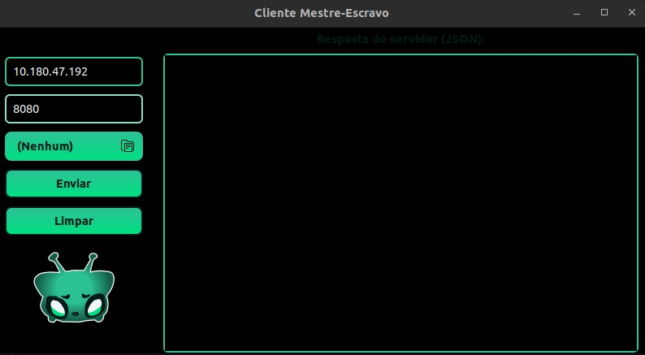
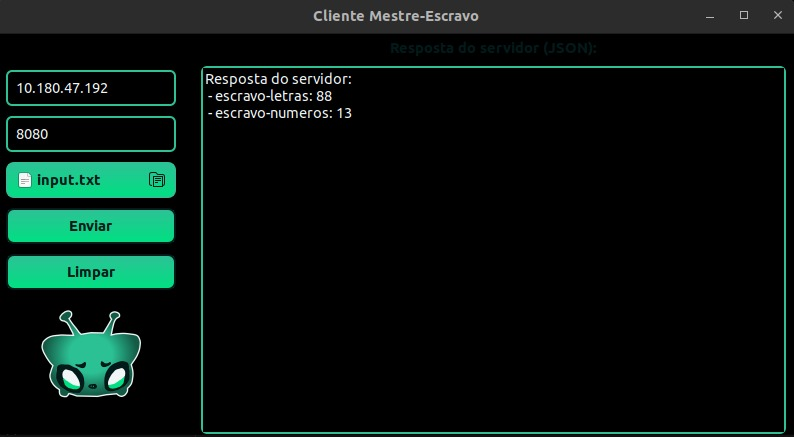

# ⚙️ TextSys - Sistema Distribuído Mestre–Escravo em C++

Este projeto implementa um **sistema distribuído** em **C++ puro**, utilizando **threads** e **containers Docker**, seguindo a arquitetura **mestre–escravo**.  


## 🎯 Objetivo

Criar um sistema cliente-servidor distribuído, onde:  
- O **Cliente** envia arquivos de texto contendo letras e números.  
- O **Servidor Mestre** coordena a execução paralela, distribuindo tarefas entre os **Servidores Escravos**.  
- Os **Servidores Escravos** processam partes específicas (contagem de letras e números).  
- O **Mestre** consolida os resultados e retorna em formato **JSON** ao Cliente.  

## 🖥️ Funcionalidades

### 🔹 Cliente
- Envia um arquivo `.txt` com letras e números.  
- Implementado como **GUI em GTK+**.  
- Apenas envia requisições **HTTP REST** ao Mestre.  
- Exibe os resultados no terminal ou interface gráfica.  

### 🔹 Servidor Mestre (Container 1)
- Recebe requisições do Cliente.  
- Dispara **duas threads** em paralelo:
  - Uma para comunicação com o Escravo 1.  
  - Outra para comunicação com o Escravo 2.  
- Antes de enviar dados, consulta se cada Escravo está disponível (`/health`).  
- Após receber as respostas, **combina os resultados** e devolve em **JSON** ao Cliente.  

### 🔹 Servidores Escravos (Containers 2 e 3)
- **Escravo 1** → expõe endpoint `/letras`, recebe texto e retorna a **quantidade de letras**.  
- **Escravo 2** → expõe endpoint `/numeros`, recebe texto e retorna a **quantidade de números**.  


## 🛠️ Requisitos Técnicos

- **Linguagem:** C++17 ou superior  
- **Concorrência:** `std::async`  
- **Comunicação REST:** `cpp-httplib`
- **Contêineres:** Docker + docker-compose para orquestração (Mestre + Escravos)  
- **Execução do Cliente:** Fora dos containers comunicando-se via rede com o Mestre  

## Como executar os servidores escravos com Docker

1. **Comando para buildar e executar**
     ```bash
     export HOST_IP=$(hostname -I | awk '{print $1}') && docker compose up --build
      ```
2. **Comando para executar (caso já tenha buildado antes)**
   ```bash
   export HOST_IP=$(hostname -I | awk '{print $1}') && docker compose up
   ```
3. **Para execultar o cliente**
   ```bash
   cd src 
   ./run.sh
   ```
## 📂 Estrutura do Projeto
```bash
.
├── LICENSE
├── README.md
├── build/                     # Arquivos de build/compilação
├── docker-compose.yml          # Orquestração dos containers
└── src/
    ├── bibs/                   # Bibliotecas externas (httplib, json.hpp)
    │   ├── httplib.h
    │   └── json.hpp
    ├── client/                 # Código do cliente
    │   ├── gui.cpp
    │   ├── gui.h
    │   ├── http_client.cpp
    │   ├── http_client.h
    │   ├── main.cpp
    ├── input.txt               # Arquivo de entrada (exemplo)
    └── server/                 # Código do servidor
        ├── master/             # Servidor Mestre
        └── slave/              # Servidores Escravos (letras/números)
   ```
## 🖼️ Interface

###  Tela do Cliente
Tela onde o usuário sobe o txt e recebe a contagem dos números e letras.  



Tela cliente depois da devolução das informações do servidor 




